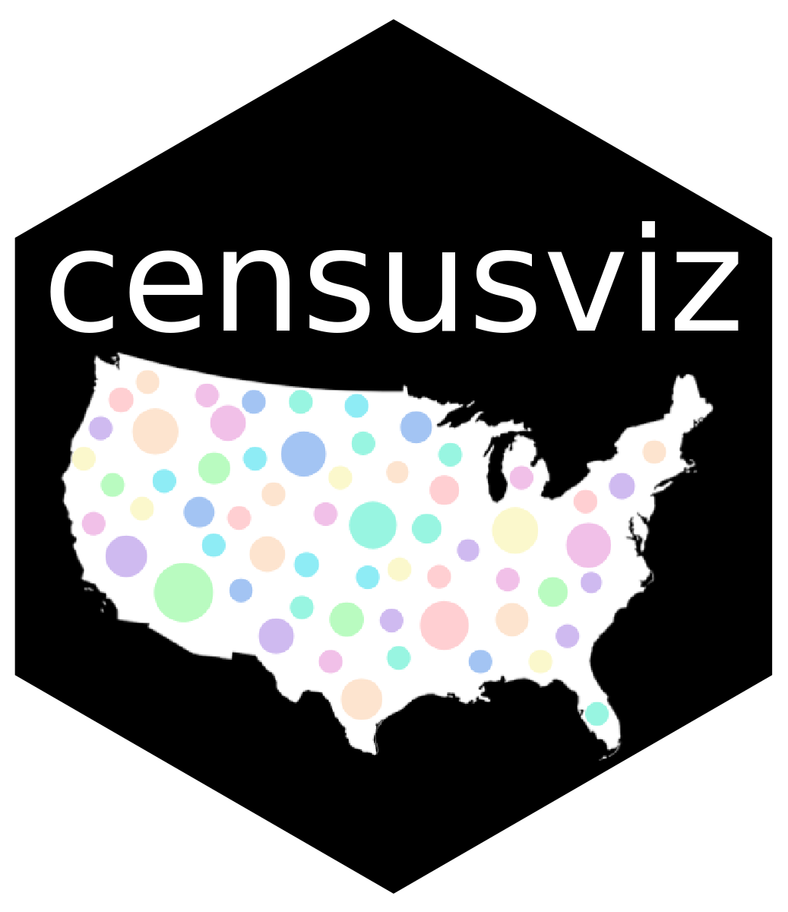
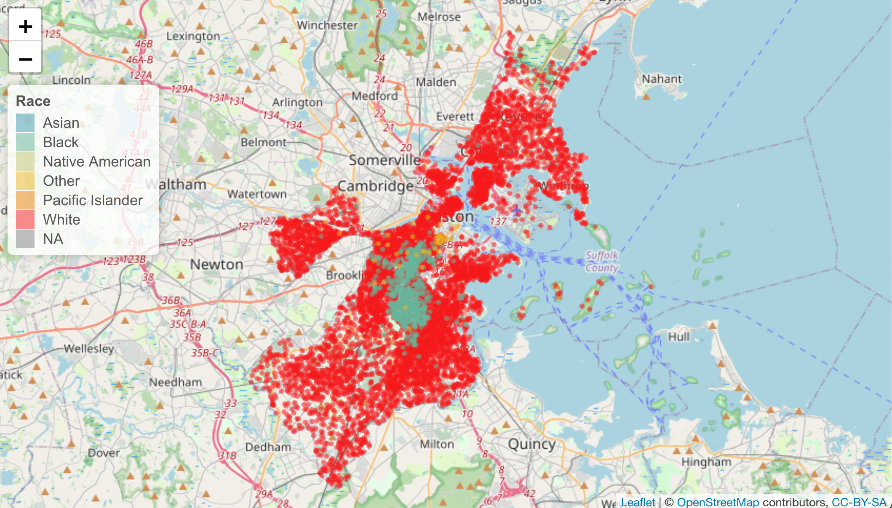
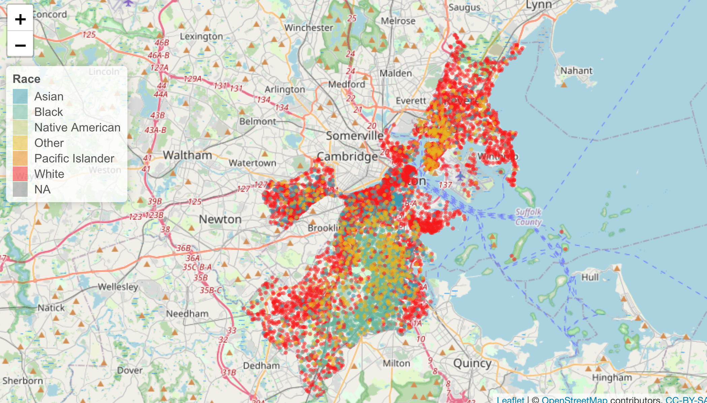

<!-- README.md is generated from README.Rmd. Please edit that file -->

```{r, include = FALSE}
knitr::opts_chunk$set(
  collapse = TRUE,
  comment = "#>",
  fig.path = "man/figures/README-",
  out.width = "100%"
)
library(dplyr)
library(ggplot2)
library(sf)
```

# censusviz  

<!-- badges: start -->
[](https://lifecycle.r-lib.org/articles/stages.html#experimental)
[](https://CRAN.R-project.org/package=censusviz)
[](https://github.com/rporta23/censusviz/actions)
<!-- badges: end -->

The [`censusviz`](https://github.com/rporta23/censusviz) package provides an interface for exploring and visualizing historical racial demographic census data (1950-2020) sourced from [IPUMS](https://data2.nhgis.org/main) for any region in the United States (by county). The package provides functionality for visualizing the data on leaflet maps as well as for accessing the data in an accessible, tidy format such that the user can then create their own visualizations. 

Since the data is very large, it is hosted on GitHub and is not contained in the package itself. The package includes a few smaller samples of the data as examples. The raw data can be accessed [here](https://drive.google.com/drive/folders/1teqLHG8fnrZA-ts0u2qFcQ84Q6hgi6EI?usp=sharing). See the vignette for more details.

This package was inspired by the `nepm` package. The nepm package was initially created as part of a [DSC-WAV](https://dsc-wav.github.io/www/projects.html) project in fall 2021 funded by the [NSF](https://www.nsf.gov/) with the goal of creating an [interactive map](https://shiny.smith.edu:3838/bbaumer/nepm/) to visualize the demographics over time of Springfield, MA in partnership with [New England Public Media](https://www.nepm.org/).  

## Installation

`censusviz` is hosted on GitHub and can be installed by running the following function:

``` {r, eval = FALSE}
remotes::install_github("rporta23/censusviz")
```

```{r example}
library(censusviz)
```

## Example 1

Visualize spatial distribution of racial demographics for any census year between 1950-2020 using `add_people()`. Dataframes with locations of dots to plot on the map for Boston, MA, Manhattan, NY, and San Francisco, CA, are included in the package. However, you can get the data for any county in the U.S. using the functions provided in `censusviz`. See the vignette for more details on how to create this type of map for any region in the U.S. 

```{r, eval = FALSE}
# create map for Boston, MA in 1960
base_map() %>%
  add_people(1960, boston_sample)
```

{height=300}
```{r, eval = FALSE}
# create map for Boston, MA in 2000
base_map() %>%
  add_people(2000, boston_sample)
```

{height=300}

## Example 2

Create a line graph to show changes in demographics over time for Boston (Suffolk County), MA. The sample of data to create this graph for Boston is included in the package. See the vignette for details on how to create this type of graph for any region.

```{r}
head(boston_data_long)
```


```{r, fig.height=3}

# group by year and race_label and summarize to create dataframe for line graph
data_long_sum <- boston_data_long %>%
  group_by(year, race_label) %>%
  summarize(total = sum(n))

# create line graph to show change over time in demographics
ggplot(data_long_sum, aes(x = year, y = total, color = race_label)) +
  geom_line() +
  labs(
    title = "Change in Racial Demographics over time in Suffolk County, MA",
    x = "Year",
    y = "Number of People",
    color = "Race"
  )
```

## See Also

If you are interested in exploring U.S. census data, see related package [`tidycensus`](https://github.com/cran/tidycensus)

## Contributors

- [Irene Foster](https://github.com/i-m-foster)
- [Catherine Park](https://github.com/CJParkNW)
- [Rose Porta](https://github.com/rporta23)
